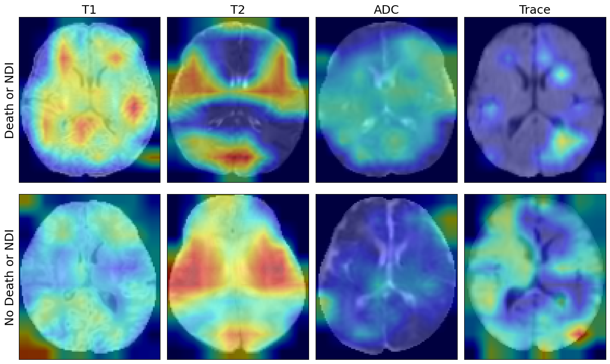
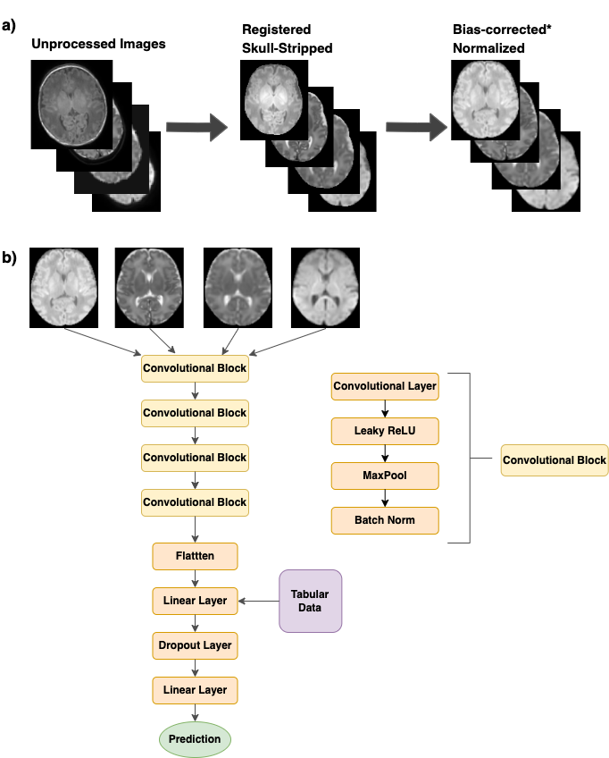

# Artificial Intelligence Outcome Prediction in Neonates with Encephalopathy (AI-OPiNE)

This repository contains the source code and trained models for the research study titled "Artificial Intelligence Outcome Prediction in Neonates with Encephalopathy (AI-OPiNE)". 

The objective of this study was to develop a deep learning algorithm to predict 2-year neurodevelopmental outcomes in neonates with Hypoxic-ischemic encephalopathy (HIE) using MRI and basic clinical data. We analyzed MRI data of term neonates with encephalopathy enrolled in the High Dose Erythropoietin for Asphyxia (HEAL) trial. Harmonized MRI protocol included T1-weighted, T2-weighted, and diffusion tensor imaging. Deep learning classifiers were trained to predict the primary outcome of the HEAL trial (death or any neurodevelopmental impairment \[NDI\] at 2 years) using multi-sequence MRI and basic clinical variables including sex and gestational age at birth. We found that the OPiNE model developed yielded high performance for predicting 2-year neurodevelopment outcomes in this study population. 



## Prerequisites

The code contained in this repository can be run using Python 3 with the dependencies listed in the `requirements.txt` file
```
sudo pip install -r requirements.txt
```

## Usage

### Dataset

The data used in this study is from the High Dose Erythropoietin for Asphyxia (HEAL) trial (doi: 10.1056/NEJMoa2119660). Public data availability is to be determined. 

### Preprocessing

Preprocessing is accomplished by using the functions in `preprocessing.py`. The full preprocessing method can be found in `split_and_preprocess.ipynb`. 

### Model Usage

The pretrained model weights for the OPiNE multichannel model and each MRI sequence can be found in `trained_models`.



The remainder of the code utilized during training, prediction, and evaluation can be found under `train_and_evaluate.py`. Additional documentation is included for each function within the file. 